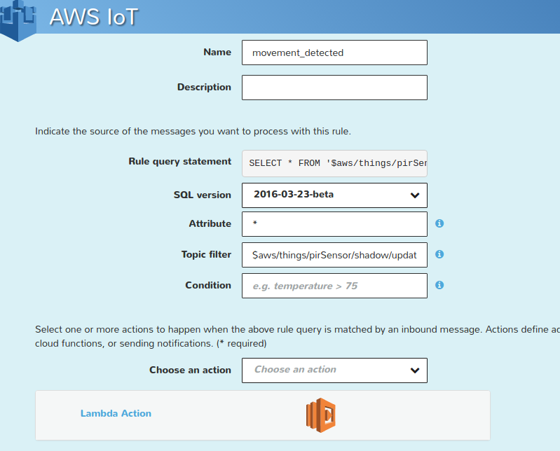

<h2>INSTRUCTION</h2>

This repository contains a test project, the main aim of which is to demonstrate, how to build "smart-home" system from scratch, using such technologies and devices:

<ul>
    <li>RaspberryPi</li>
    <li>Arduino</li>
    <li>Pir Sensor</li>
    <li>Ethernet module for Arduino</li>
    <li>AWS</li>
    <li>NodeJS</li>
</ul>

<h3>First of all, you need to prepare your working space by necessary software installation</h3>
<ol>
    <li>You need Arduino IDE, to make arduino run the code you write. You can use following link to download it: https://www.arduino.cc/en/Main/Software
    </li>

    <li>You also need NodeJS to be installed on your RaspberryPi device. You can find files to download and installation tutorial on it`s official site: https://nodejs.org
    </li>

    <li>To be allowed to write JavaScript applications which access the AWS IoT Platform via MQTT or MQTT over the Secure WebSocket Protocol, you have to install AWS IoT SDK for JavaScript. https://github.com/aws/aws-iot-device-sdk-js You also can find a
        lot of usefull examples on the page of this repository.</li>

    <li>Install MQTT broker on your RaspberryPi, we use Mosquitto in our project. Here is a good tutorial how to install and test it: http://www.switchdoc.com/2016/02/tutorial-installing-and-testing-mosquitto-mqtt-on-raspberry-pi/
    </li>

    <li>A better part of configuration work will be done on AWS, so you need an AWS account.(<a href="https://github.com/dev1lmini/Home-KIT/blob/master/Raspberry%2BAWS%2BArduino%20example1/AWS.md">Setup AWS account</a>)</li>

</ol>
<h3>Workflow</h3>

The project provides simple functionality. We have Pir Sensor , Green Led, Yellow Led and Red Led connected to arduino microcontroller. And our aim is to light Red Led if there is any motion detected, otherwise Green Led should be lighted, Yellow Led
    is lighted on startup

    

Pir-sensor, connected to the arduino microcontroller, detects motion and emits event on mqtt topic 'sensor/motion'. MQTT client running on NodeJs is subscribed to 'sensor/motion' topic , when the event from sensor is recieved it updates Pir-Sensor shadow
    state on Amazon. There is a rule on AWS IOT binded to Pir-Sensor shadow updating, this rule calls AWS Lambda function, which changes lights shadow state on Amazon. When above change is done, we get event on RaspberryPi, and then update the leds state
    on arduino.

<h3>There are several steps to put this stuff working together</h3>
<ol>
    <li>Connect Pir Sensor, Ethernet module and leds with Arduino
        <ul>
            <li>Example how to connect Pir Sensor you can find here https://github.com/dev1lmini/Home-KIT/tree/master/Arduion%20PIR%20Sensor</li>
            <li>Example how to connect Ethernet module you can find here https://github.com/dev1lmini/Home-KIT/tree/master/Arduino%20Install%20Server</li>
            <li>Here is the circuit example for leds
                

                    
                

            </li>
        </ul>
    </li>
    <li>Upload the code on arduino
        <ul>
            <li>Add library arduino_uip-master and ArduinoJson (also you must to add some libraries from Arduino library manager, see log output)</li>
            <li>Before running choose Arduino Board and Port in Arduino -> Tools</li>
            <li>Run project (sketch...)</li>
            <li>Compile</li>
            <li>Press upload button</li>
        </ul>
    </li>
    <li>On Raspberry run Mosquitto MQTT server, it will take 1883 port by default
        
<code>sudo mosquitto start</code>

    </li>
    <li>Install dependencies for NodeJs script
        <ul>
            <li>Change your current directory to "backend" and run:
                
<code>npm install</code>

            </li>
            <li>Place aws-iot-device-sdk-js into your node_modules folder</li>
        </ul>
    </li>
    <li>Create folder 'certs' in the root of the project, certificates from AWS will be placed here</li>
    <li>Go to IoT section on the AWS website</li>
    <li>You have to create two "things": the first one is for Pir Sensor, and another one is for leds. You can name this things whatewer you like,
       but you shouldn`t forget to set property names in pir-sensor.js and leds.js. You also have to download
        appropriate certificates. Put them in certs directory and set the correct path in pir-sensor.js and leds.js files.
        

        <pre>  <var>
              var thingShadows = awsIot.thingShadow({
                    keyPath: 'certs/your_path/private.pem.key',
                    certPath: 'certs/your_path/certificate.pem.crt',
                    caPath: 'certs/root-CA.crt',
                    clientId: 'testClient2',
                    region: 'eu-central-1'
                });
          </var></pre>
          

          Check out this tutorials to learn more about getting started with AWS:  http://docs.aws.amazon.com/iot/latest/developerguide/iot-gs.html 
          https://blog.louisborsu.be/aws-iot-getting-started-tutorial-with-nodejs/
    </li>
    <li>Now you have to create Lamba Function. Use this guide to become familiar with base principles: http://docs.aws.amazon.com/lambda/latest/dg/welcome.html
        
Here is Lambda Function for our project.  It triggers leds state from green to red and vise versa.

        

        <pre>
           <var>
             'use strict';
             var AWS=require('aws-sdk');
             console.log('Loading function');

             exports.handler = (event, context, callback) => {
                 console.log('Received event:', JSON.stringify(event, null, 2));
                 var iotdata = new AWS.IotData({endpoint: 'myendpoint.iot.eu-central-1.amazonaws.com'});
                 console.log(event)
                 var motions=event.state.reported.motions;
                 var params;
                 if(motions==1){
                      params = {
                         payload: '{"state":{"reported":{"leds_set":[{"sensor":{"name":"yellow","value":0}},{"sensor":{"name":"green","value":0}},{"sensor":{"name":"red","value":250}}]}}}',
                         thingName: 'Leds'
                     };
                 }else{
                      params = {
                         payload: '{"state":{"reported":{"leds_set":[{"sensor":{"name":"yellow","value":0}},{"sensor":{"name":"green","value":250}},{"sensor":{"name":"red","value":0}}]}}}',
                         thingName: 'Leds'
                     };
                 }
                     iotdata.updateThingShadow(params, function(err, data) {
                         if (err) console.log(err, err.stack);
                         else     console.log(data);
                      });
             };

          </var></pre>
        

        
It is important to mention, that you must use this function under the role, which has appropriate permissions to access AWS IoT.

    </li>
    <li>If the Lambda is already configured, now it is time to create a rule to invoke the function</li>
    

        
    

    <li>The "Lock" thing must execute "password_validation" lambda, "Door" thing must execute "door_notification" lambda and "Room" thing must execute "gas_sensor" lambda</li>
    <li>Also, you need to set default Shadow states on "Door" thing: 
    <pre>
{
  "desired": {
    "open": true
  },
  "reported": {
    "open": true
  }
}
    </pre>
    </li>
    <li>Everything is ready to start, so now you need to run next scripts in different console windows:
    
Before starting you must insert your Raspberry IP on Arduino, to get IP run <code>ifconfig</code> on Raspberry

        
<code>node leds</code>

        
<code>node pir-sensor</code>

    </li>
</ol>
